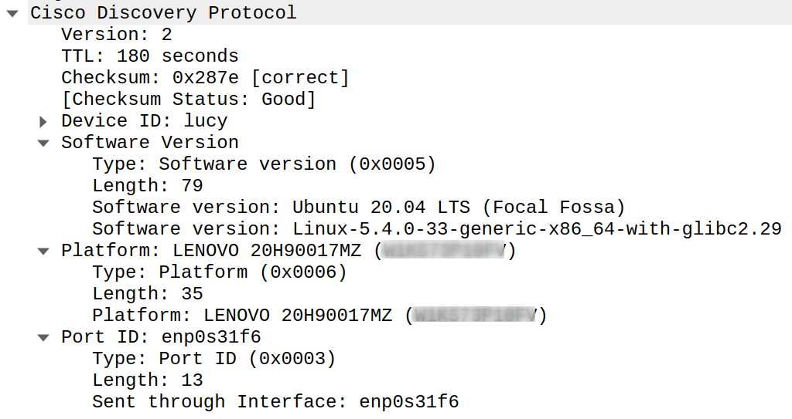

# pycdpd

Cisco Discovery Protocol (CDP) daemon written in Python.

## About

This daemon implements a simple version of the Cisco Discovery Protocol (CDP).

## Manual Installation

Clone the repository.
```
git clone https://github.com/frei-style/pycdpd
```
Change into the working copy.
```
cd pycdpd
```
Copy the daemon.
```
sudo cp pycdpd /usr/local/bin/
```
Correct the permissions.
```
sudo chmod u+rx /usr/local/bin/pycdpd
```
Copy the service file for systemd.
```
sudo cp systemd/pycdpd.service /etc/systemd/system/
```
Reload systemd.
```
systemctl daemon-reload
```
Enable the service.
```
systemctl enable pycdpd
```
Start the service.
```
systemctl start pycdpd
```

## Examples

### Package in Wireshark



### Package in tcpdump

```
[root@samantha ~]# tcpdump -n -i bond0.666 'ether host 01:00:0c:cc:cc:cc and ether[16:4] = 0x0300000C and ether[20:2] == 0x2000' -vvvv
tcpdump: listening on bond0.666, link-type EN10MB (Ethernet), capture size 262144 bytes
23:35:13.589382 CDPv2, ttl: 180s, checksum: 0x340e (unverified), length 173
        Device-ID (0x01), value length: 8 bytes: 'samantha'
        Version String (0x05), value length: 101 bytes: 
          Red Hat Enterprise Linux Server 8.2 (Ootpa)
          Linux-4.18.0-193.el8.x86_64-x86_64-with-redhat-8.2-Ootpa
        Platform (0x06), value length: 35 bytes: 'HPE ProLiant DL380 Gen10 (**********)'
        Port-ID (0x03), value length: 9 bytes: 'bond0.666'
```

## Links

* [Cisco White Paper: Device Discovery Protocols](https://www.cisco.com/en/US/technologies/tk652/tk701/technologies_white_paper0900aecd804cd46d.html)
* [Cisco: Cisco Discovery Protocol Version 2](https://www.cisco.com/c/en/us/td/docs/ios-xml/ios/cdp/configuration/15-mt/cdp-15-mt-book/nm-cdp-discover.html)
* [Wireshark: Cisco Discovery Protocol (CDP)](https://wiki.wireshark.org/CDP)
* [Data Network Resource: Cisco Discovery Protocol (CDP)](http://www.rhyshaden.com/cdp.htm)

## Disclaimer

I'm not a programmer and I'm not a network expert. Use at your own risk.

## TODO

* Support more information like ip addresses, vlan
* Tests
* Code documentation
* A lot of refactoring
* Packages: deb, rpm, pip
